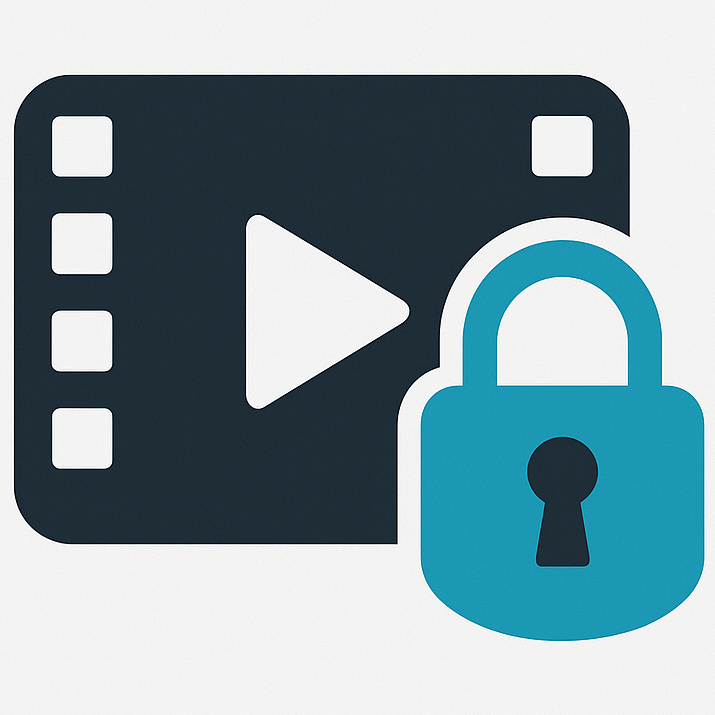

# VideoVault - WebApp

Progressive Web App for end-to-end encrypted video collection. \
Written in TypeScript

This is the repository for the WebApp, for watching videos and managing user data. \
There's also an electron app called
[VideoVault Studio](https://github.com/johanna-herrmann/video-vault/video-vault-studio)
for editing and uploading videos. \
See also: [Documentation](https://github.com/johanna-herrmann/video-vault/video-vault-documentation)

